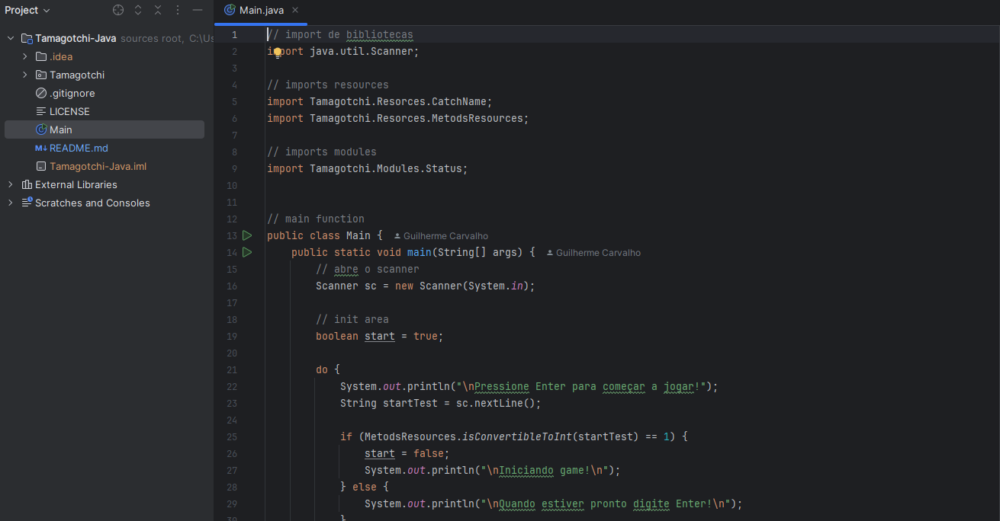

 

# todolist-wepage-v2

> Este projeto foi desenvolvido em Java e representa uma versão mais adulta de um Tamagotchi 🐾, um amigo virtual que precisa realizar diversas atividades para se manter saudável e funcional.

O Tamagotchi pode:
- Se alimentar.
- Trabalhar.
- Dormir.
- Gerenciar seu dinheiro.
- Cuidar do seu humor.

## Tecnologias

## Contribuir

1. **Clonar projeto:**: `git clone https://github.com/guicarbar/tamagotchi-java.git`
2. **Criar feature/branch:**: `git checkout -b feature/Nome-da-branch`

## Licença

Este projeto está sob a licença [MIT](LICENSE) License. 